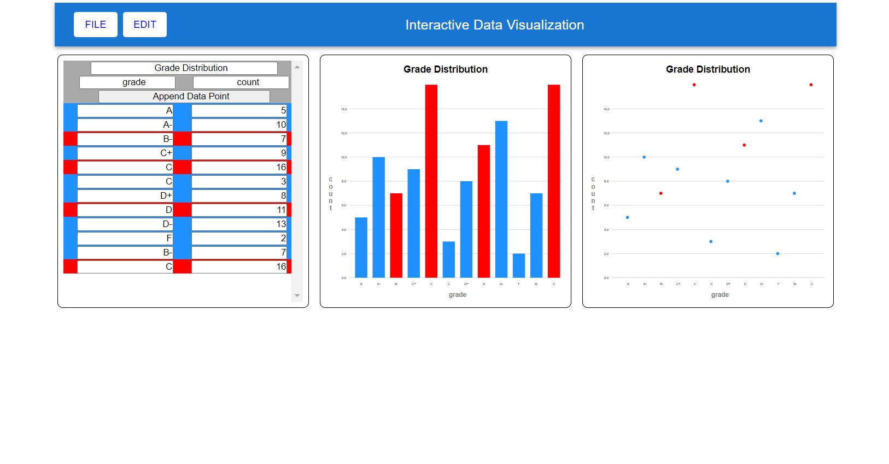

# Interactive-Data-Display
An interactive data display made with React, d3, and MUI

This app displays data in multiple linked views. The user can input their own data, edit existing data (copy, paste, remove, undo, redo), and rename datasets as well as their axis. This was originally a MERN project, but the corresponding MongoDB database has since shut down, removing save functionality. There are still 3 default datasets to choose from that users can load. Clicking on a data point on a graph turns it red in all displays, and clicking it again on any display returns it to blue (brushing). Any number of data points can be selected at one time. Hovering over a data point displays its data in a tooltip.

In the project directory, you can run:

### `npm start`

to run the app in the development mode.\
Open [http://localhost:3000](http://localhost:3000) to view it in your browser.

